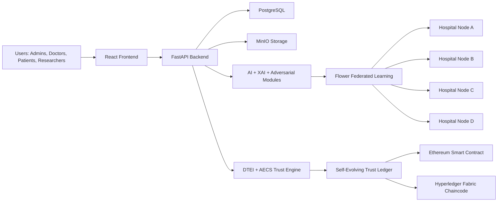
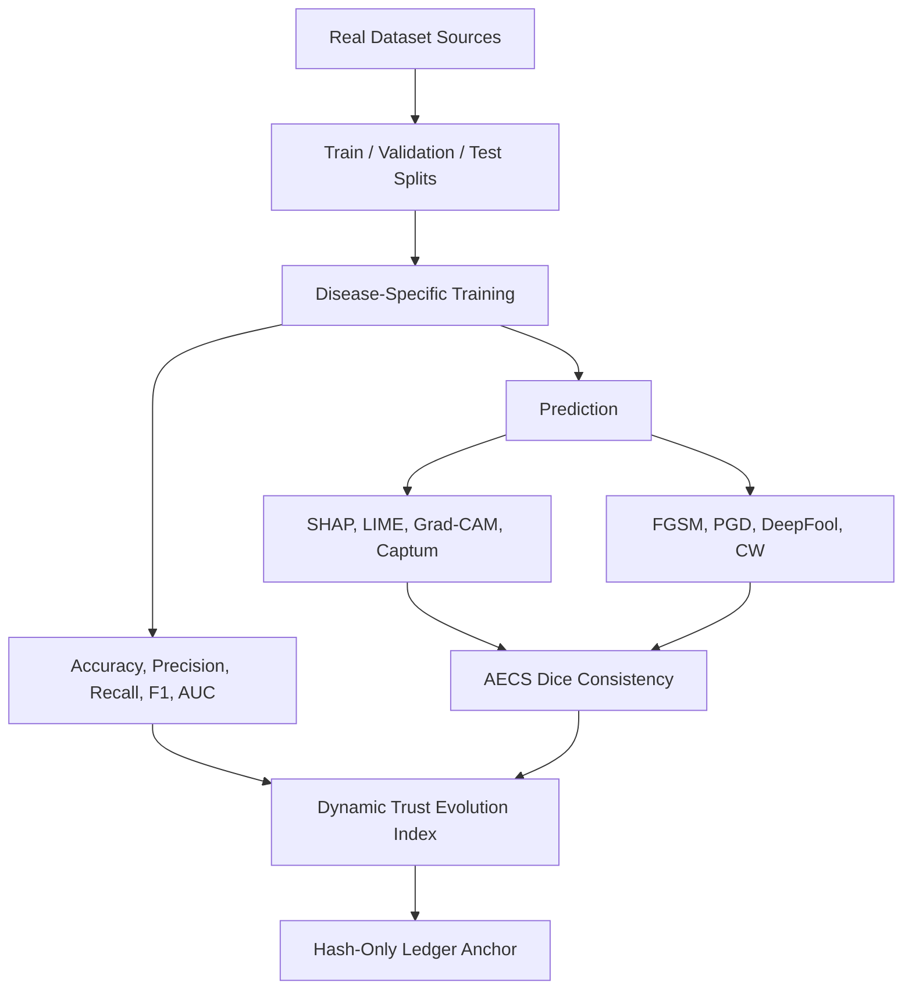
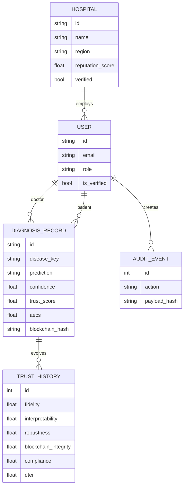
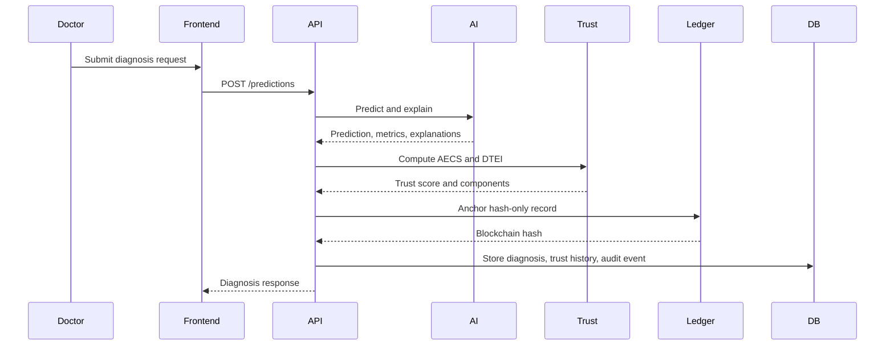
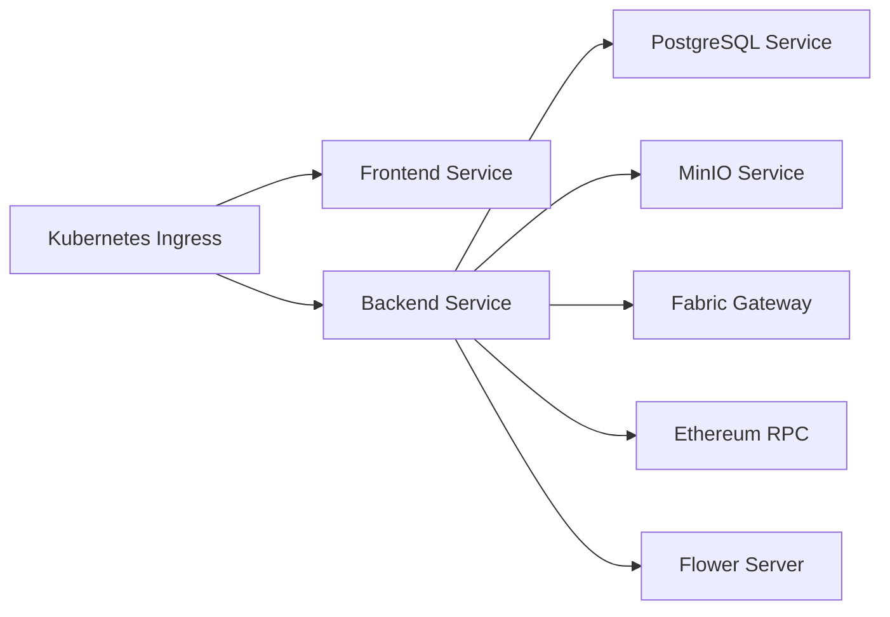

# Diagrams

## System Architecture

```mermaid
flowchart LR
  U["Users: Admins, Doctors, Patients, Researchers"] --> FE["React Frontend"]
  FE --> API["FastAPI Backend"]
  API --> DB["PostgreSQL"]
  API --> OBJ["MinIO Storage"]
  API --> AI["AI + XAI + Adversarial Modules"]
  API --> TRUST["DTEI + AECS Trust Engine"]
  TRUST --> LEDGER["Self-Evolving Trust Ledger"]
  LEDGER --> ETH["Ethereum Smart Contract"]
  LEDGER --> FAB["Hyperledger Fabric Chaincode"]
  AI --> FL["Flower Federated Learning"]
  FL --> HA["Hospital Node A"]
  FL --> HB["Hospital Node B"]
  FL --> HC["Hospital Node C"]
  FL --> HD["Hospital Node D"]
```

## Methodology

```mermaid
flowchart TD
  DATA["Real Dataset Sources"] --> SPLIT["Train / Validation / Test Splits"]
  SPLIT --> TRAIN["Disease-Specific Training"]
  TRAIN --> METRICS["Accuracy, Precision, Recall, F1, AUC"]
  TRAIN --> PRED["Prediction"]
  PRED --> XAI["SHAP, LIME, Grad-CAM, Captum"]
  PRED --> ATTACK["FGSM, PGD, DeepFool, CW"]
  XAI --> AECS["AECS Dice Consistency"]
  ATTACK --> AECS
  METRICS --> DTEI["Dynamic Trust Evolution Index"]
  AECS --> DTEI
  DTEI --> HASH["Hash-Only Ledger Anchor"]
```

## ER Diagram

```mermaid
erDiagram
  HOSPITAL ||--o{ USER : employs
  USER ||--o{ DIAGNOSIS_RECORD : doctor
  USER ||--o{ DIAGNOSIS_RECORD : patient
  DIAGNOSIS_RECORD ||--o{ TRUST_HISTORY : evolves
  USER ||--o{ AUDIT_EVENT : creates

  HOSPITAL {
    string id
    string name
    string region
    float reputation_score
    bool verified
  }
  USER {
    string id
    string email
    string role
    bool is_verified
  }
  DIAGNOSIS_RECORD {
    string id
    string disease_key
    string prediction
    float confidence
    float trust_score
    float aecs
    string blockchain_hash
  }
  TRUST_HISTORY {
    int id
    float fidelity
    float interpretability
    float robustness
    float blockchain_integrity
    float compliance
    float dtei
  }
  AUDIT_EVENT {
    int id
    string action
    string payload_hash
  }
```

## Sequence Diagram

```mermaid
sequenceDiagram
  participant Doctor
  participant Frontend
  participant API
  participant AI
  participant Trust
  participant Ledger
  participant DB

  Doctor->>Frontend: Submit diagnosis request
  Frontend->>API: POST /predictions
  API->>AI: Predict and explain
  AI-->>API: Prediction, metrics, explanations
  API->>Trust: Compute AECS and DTEI
  Trust-->>API: Trust score and components
  API->>Ledger: Anchor hash-only record
  Ledger-->>API: Blockchain hash
  API->>DB: Store diagnosis, trust history, audit event
  API-->>Frontend: Diagnosis response
```

## Deployment

```mermaid
flowchart LR
  INGRESS["Kubernetes Ingress"] --> FRONT["Frontend Service"]
  INGRESS --> BACK["Backend Service"]
  BACK --> PG["PostgreSQL Service"]
  BACK --> MINIO["MinIO Service"]
  BACK --> FABRIC["Fabric Gateway"]
  BACK --> ETHRPC["Ethereum RPC"]
  BACK --> FLOWER["Flower Server"]
```
